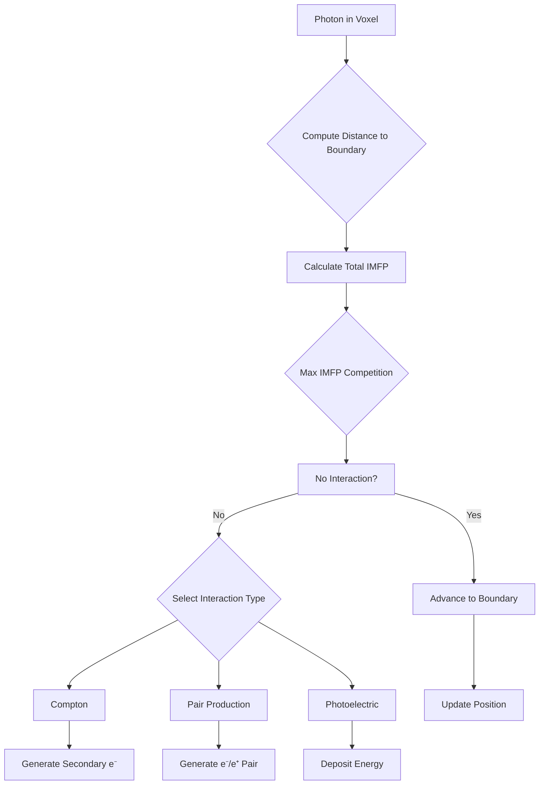
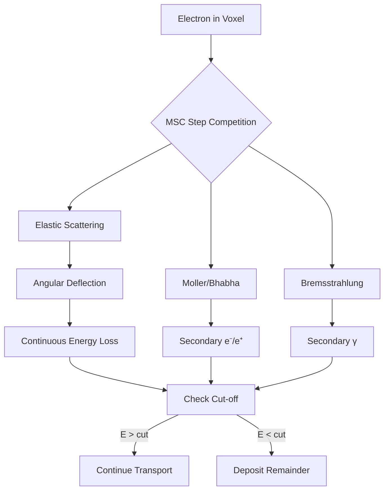
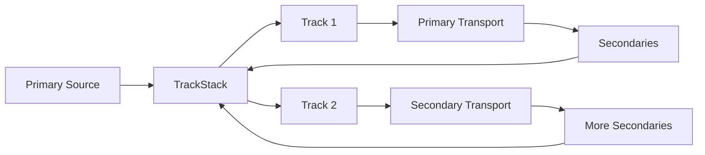
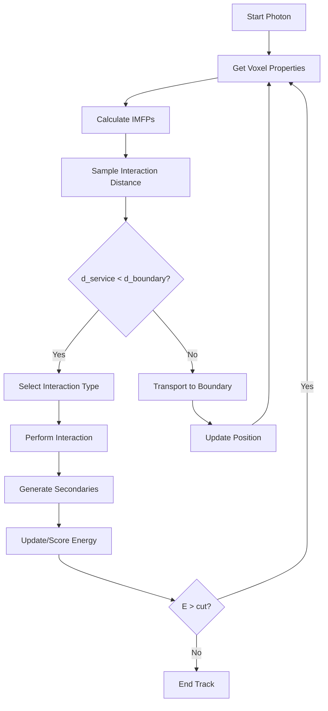
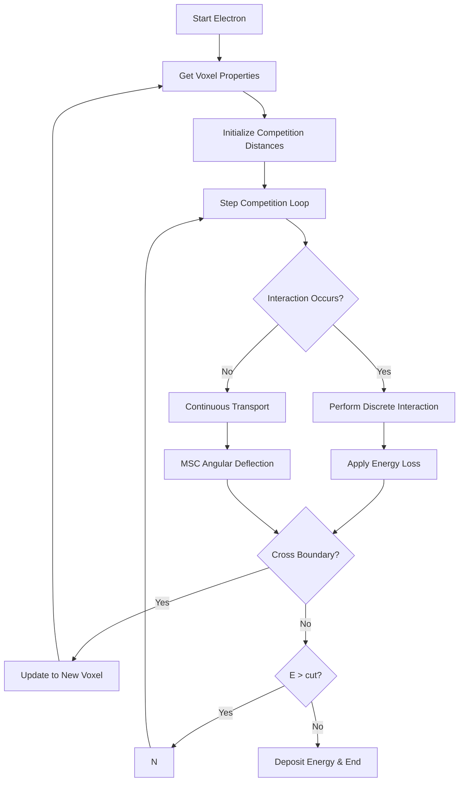

# DPM-g4cpp Physics Implementation Documentation

## Table of Contents
1. [Overview](#overview)
2. [Particle Types and Energy Ranges](#particle-types-and-energy-ranges)
3. [Photon Physics](#photon-physics)
4. [Electron/Positron Physics](#electronpositron-physics)
5. [Energy Deposition Mechanisms](#energy-deposition-mechanisms)
6. [Particle Transport Algorithms](#particle-transport-algorithms)
7. [Cascading and Secondary Particle Production](#cascading-and-secondary-particle-production)
8. [Sampling Methods and Data Structures](#sampling-methods-and-data-structures)
9. [Physics Calculation Workflows](#physics-calculation-workflows)
10. [Interaction with Human Tissue](#interaction-with-human-tissue)

---

## Overview

The DPM-g4cpp (Dose Planning Method) implements a deterministic, rejection-free Monte Carlo simulation for accurate dose calculations in radiotherapy. The physics model handles electromagnetic interactions of photons, electrons, and positrons with human tissue materials in the energy range 1 keV to 21 MeV.

### Key Design Principles
- **Deterministic algorithms**: No rejection loops during interaction computation
- **Pre-computed physics data**: All interaction cross-sections and sampling tables generated offline
- **Voxelized geometry**: Cubic voxels (typically 1 mm) with material assignment per voxel
- **Track-stack architecture**: Efficient particle management for cascades

---

## Particle Types and Energy Ranges

| Particle Type | Code | Energy Range | Tracking Cut | Production Threshold |
|---------------|------|--------------|--------------|---------------------|
| Electron (e⁻) | -1 | 1 keV - 21 MeV | 0.2 MeV | 0.2 MeV |
| Positron (e⁺) | +1 | 1 keV - 21 MeV | 0.2 MeV | 0.2 MeV |
| Photon (γ) | 0 | 1 keV - 21 MeV | 0.05 MeV | 0.05 MeV |

### Energy Grid Configuration
- **Electrons**: 128 discrete energy points (logarithmic distribution)
- **Photons**: 1024 discrete energy points (logarithmic distribution)
- **Interpolation**: Linear between grid points

---

## Photon Physics

### 1. Photon Transport Mechanism



### 2. Photon Interaction Processes

#### 2.1 Compton Scattering
- **Cross-section**: Based on Klein-Nishina differential cross-section
- **Energy transfer**: Sampled using alias tables `SimKNTables`
- **Angular distribution**: Polar angle derived from energy transfer
- **Secondary particle**: Electron recoil energy

**Energy Transfer Calculation:**
```
Eε = Eγ × ε  (where ε is the sampled energy fraction)
cosθ = 1 - (1-ε)/(ε × Eγ/mₑc²)
Ee⁻ = Eγ - Eε
```

#### 2.2 Pair Production
- **Threshold**: Eγ > 2 × mₑc² = 1.022 MeV
- **Energy sharing**: Uniform distribution between e⁻ and e⁺
- **Angular approximation**: Both particles continue in primary photon direction
- **Positron fate**: Annihilation at rest producing 2 × 511 keV photons

#### 2.3 Photoelectric Effect
- **Complete absorption**: All photon energy deposited locally
- **Fluorescence X-rays**: Neglected (assumed to be locally absorbed)
- **Auger electrons**: Assumed to be below tracking cut

### 3. Photon Data Structures

| Data Structure | Purpose | Units | Scaling |
|----------------|---------|-------|---------|
| `SimIMFPPhoton` | Material-specific IMFPs | 1/mm | ÷ density [g/cm³] |
| `SimIMFPMaxPhoton` | Global maximum IMFP | 1/mm | - |
| `SimKNTables` | Klein-Nishina sampling | - | - |

---

## Electron/Positron Physics

### 1. Electron Transport Mechanism



### 2. Multiple Coulomb Scattering (MSC)

#### 2.1 Step Length Control
The MSC step length is determined by a sigmoid-like function:

```
Smax(E) = { s_low,            E < e_cross
          s_high,           E > e_cross
          interpolation,    otherwise }
```

Parameters:
- `s_low = 5 mm` (minimum step)
- `s_high = 10 mm` (maximum step)
- `e_cross = 12 MeV` (cross-over energy)

#### 2.2 Goudsmit-Saunderson Angular Distribution
- **Reference material**: Material with index 0
- **Sampling**: Alias tables in `SimGSTables`
- **Implementation**: Rejection-free sampling of polar angle

The scattering strength quantity:
```
K₁(E) = Smax(E) / λ_tr¹(E)
```
where λ_tr¹ is the first transport mean free path.

#### 2.3 Hinge-Substep Algorithm
1. **Hinge point**: Random point within MSC step
2. **First sub-step**: Transport to hinge point
3. **Angular deflection**: Apply MSC scattering
4. **Second sub-step**: Complete remaining distance

### 3. Discrete Interactions

#### 3.1 Moller Scattering (e⁻ → e⁻ + e⁻)
- **Threshold**: E > 2 × E_cut
- **Cross-section**: Energy-independent approximation
- **Energy transfer**: Sampled using `SimMollerTables`
- **Angular relationship**: Energy-momentum conservation

**Secondary particle kinematics:**
```
cosθₛ = √[Eₛ(E₀ + 2mₑc²) / (E₀(Eₛ + 2mₑc²))]
```

#### 3.2 Bhabha Scattering (e⁺ → e⁺ + e⁻)
- **Implementation**: Same as Moller for simplicity
- **Approximation**: No distinction from e⁻ case

#### 3.3 Bremsstrahlung
- **Cross-section**: Seltzer-Berger differential cross-section
- **Energy sampling**: `SimSBTables` with alias method
- **Angular approximation**: Mean angle approximation

**Emission angle approximation:**
```
cosθ ≈ 1 - (√2 × mₑc² / (E + mₑc²))²
```

### 4. Stopping Power

#### 4.1 Continuous Energy Loss
- **Total dE/dx**: Radiative + collisional stopping power
- **Implementation**: `SimStoppingPower`
- **Units**: MeV/mm (scaled by density)

#### 4.2 Range Calculation
For step length determination:
```
R(E) = ∫(dE/dx)⁻¹ dE
```

### 5. Positron-Specific Processes

#### 5.1 Positron Annihilation
- **At rest**: 2 × 511 keV photons emitted back-to-back
- **In-flight**: Not implemented (DPM approximation)

---

## Energy Deposition Mechanisms

### 1. Local Energy Deposition

| Process | Mechanism | Location | Amount |
|---------|-----------|----------|--------|
| Below-cut electrons | Direct scoring | Production voxel | Full energy |
| Photoelectric | Full absorption | Interaction voxel | Eγ |
| Positron annihilation | At rest assumption | Stopping voxel | Eₑ⁺ |

### 2. Continuous Energy Loss

For each electron/positron sub-step:
```
ΔE = (dE/dx)(E, ρ) × Δs
Scored in traversed voxel
```

### 3. Voxel Scoring Implementation

```cpp
// Energy deposition in voxel
geom.Score(energy, voxel_z_index);

// 3D scoring would be:
geom.Score(energy, x_index, y_index, z_index);
```

---

## Particle Transport Algorithms

### 1. Track-Stack Architecture



### 2. Distance-to-Boundary Calculation

For cubic voxels with position (x, y, z) and direction (u, v, w):
```
if u > 0: dx = (ix + 0.5) × size - x
else:    dx = x - (ix - 0.5) × size
t_boundary = min(dx/|u|, dy/|v|, dz/|w|)
```

### 3. Continuous Tracking Loop

```cpp
while (track.Ekin > 0) {
    // 1. Get voxel material and density
    material = geom.GetMaterialIndex(track.boxIndx);
    density = geom.GetVoxelMaterialDensity(material);

    // 2. Compute distance to boundary
    step = geom.DistanceToBoundary(track.pos, track.dir);

    // 3. Check interaction competition
    interaction = CheckInteraction(track, step, density);

    // 4. Transport or interact
    if (interaction.occurs) {
        PerformInteraction(track, interaction.type);
    } else {
        TransportStep(track, step);
    }

    // 5. Score energy if below cut
    if (track.Ekin < cut) {
        geom.Score(track.Ekin, track.boxIndx[2]);
        break;
    }
}
```

---

## Cascading and Secondary Particle Production

### 1. Photon-Induced Cascades

```
γ → e⁻ (Compton) → secondary γ (Brems) → e⁻ (Compton) → ...
γ → e⁺ + e⁻ (Pair) → e⁺ annihilation → 2γ → ...
```

### 2. Electron-Induced Cascades

```
e⁻ → γ (Brems) → e⁻ (Compton) → e⁻ (Moller) → ...
e⁻ → e⁻ + e⁻ (Moller) → both e⁻ continue transport
```

### 3. Cascade Termination

Cascades terminate when:
- All particles fall below their tracking cuts
- All particles escape the geometry
- Energy is fully deposited

---

## Sampling Methods and Data Structures

### 1. Alias Sampling Method

For rejection-free sampling of arbitrary distributions:

```mermaid
graph TD
    A[Discretized PDF] --> B[Normalize Columns]
    B --> C[Create Alias Table]
    C --> D[Sample: i = floor&#40;N×u₁&#41;]
    D --> E{u₂ < Pᵢ/norm?}
    E -->|Yes| F[Accept i]
    E -->|No| G[Take alias index]
```



### 2. Data Structure Organization

| Structure | Size | Storage | Access Pattern |
|-----------|------|---------|----------------|
| `SimLinAliasData` | N points | {x, y, alias_w, alias_i} | Random access |
| `SimDataLinear` | N points | {x_min, x_max, linear} | Linear search |
| `SimDataSpline` | N points | {x_min, x_max, spline} | Binary search |

### 3. Interpolation Schemes

#### 3.1 Linear Interpolation
```
f(x) = f(x₁) + (x - x₁) × (f(x₂) - f(x₁))/(x₂ - x₁)
```

#### 3.2 Spline Interpolation
Used for smooth energy-dependent quantities:
- Stopping powers
- IMFP values
- Cross-sections

---

## Physics Calculation Workflows

### 1. Photon Transport Workflow



### 2. Electron Transport Workflow



### 3. Material Scaling Implementation

For IMFPs scaled by material density:
```cpp
// IMFP in [1/mm] after scaling
imfp_actual = imfp_table[ekin, material] * density[voxel] / 1000.0;

// Where density is in [g/cm³] and conversion includes:
density / 1000.0  // g/cm³ → g/mm³ (conversion factor)
```

---

## Interaction with Human Tissue

### 1. Material Composition

| Material | Density (g/cm³) | Main Components | Medical Relevance |
|----------|-----------------|----------------|-------------------|
| Water | 1.0 | H₂O | Soft tissue equivalent |
| Titanium | 4.51 | Ti | Implants |
| Bone | 1.85 | Ca₁₀(PO₄)₆(OH)₂ | Skeletal tissue |

### 2. Tissue-Specific Effects

#### 2.1 Heterogeneous Geometry
The simulation supports:
- Multi-layer slab geometries
- Material interfaces
- Density variations

#### 2.2 Dose Distribution Features
- **Build-up region**: Due to electron equilibrium
- **Interface effects**: Enhanced/backscattered dose at material boundaries
- **Range straggling**: Statistical variation in particle penetration

#### 2.3 Biological Considerations
- **Water equivalence**: Water used as soft tissue reference
- **CT number conversion**: Not implemented directly but supported through geometry
- **Organ-at-risk assessment**: Possible through voxel-based dose scoring

### 3. Validation Against Reference Data

The simulation has been validated against:
- Original DPM results (water-titanium-bone geometry)
- Deep dose distribution profiles
- Interface dose perturbations

---

## Performance Considerations

### 1. Optimization Strategies
- **Pre-computed tables**: Eliminate runtime calculations
- **Alias sampling**: Rejection-free sampling efficiency
- **Deterministic step sizes**: Avoid while-loop divergence
- **Memory locality**: Organized data structures

### 2. GPU/FPGA Suitability
The deterministic nature and lack of rejection loops make this implementation highly suitable for:
- Parallel particle tracking
- SIMD vectorization
- Hardware acceleration

### 3. Accuracy vs Performance Trade-offs
- **Energy grid density**: 128/1024 points balance
- **Step size parameters**: Tunable for accuracy
- **Physical approximations**: Positron physics simplified

---

## References

1. Sempau J, Wilderman SJ, Bielajew AF. *DPM, a fast, accurate Monte Carlo code optimized for photon and electron radiotherapy treatment planning dose calculations*. Phys Med Biol. 2000;45(8):2263-91.

2. Klein O, Nishina Y. *Über die Streuung von Strahlung durch freie Elektronen nach der neuen relativistischen Quantendynamik des Diracs*. Z Phys. 1929;52:853-68.

3. Seltzer SM, Berger MJ. *Bremsstrahlung energy spectra and angular distributions in thin gold targets*. Phys Rev. 1982;26:657-670.

4. Goudsmit S, Saunderson JLC. *Multiple scattering of electrons*. Phys Rev. 1940;57:57-68.

5. Møller C. *Zur Theorie des Durchgangs schneller Elektronen durch Materie*. Ann Phys. 1931;14:531-585.